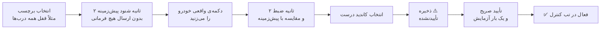
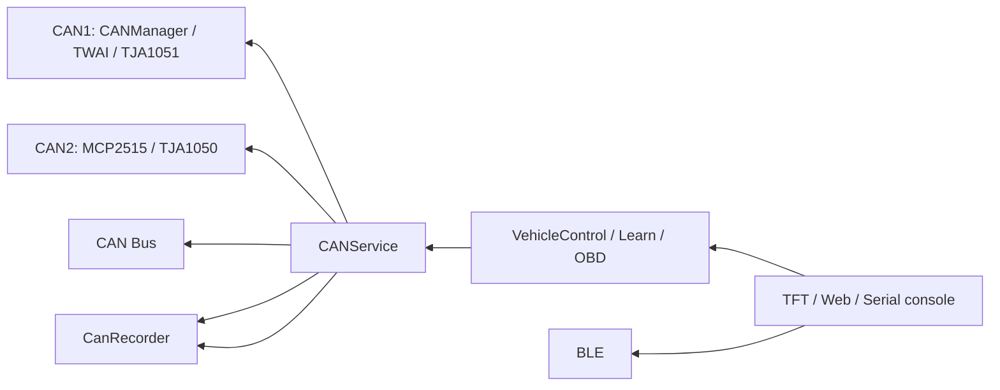

<div align="center">

<h1 dir="rtl" id="-cartouch">🚗 CarTouch</h1>

**پایش و کنترل خودرو با ESP32-S3 و CAN Bus — لمسی، وب، و یادگیرنده**


[](https://github.com/boss-splus2/CarTouch/actions/workflows/main.yml)

</div>

<div dir="rtl">

> [!WARNING]
> ‏CarTouch مستقیماً روی **CAN Bus زنده‌ی خودرو** کار می‌کند. ارسال یک فریم اشتباه می‌تواند باعث رفتار ناخواسته‌ی خودرو شود. توسعه و آزمایش را ابتدا روی میز و در شرایط کنترل‌شده انجام دهید، حالت **Listen-Only** را تا زمان اطمینان فعال نگه دارید و هر فرمان کنترلی را فقط روی خودرویی اجرا کنید که اختیار آزمایش آن را دارید.

> [!IMPORTANT]
> **Beta — روی خودرو تست‌نشده؛ فقط build/native test.** هیچ ادعایی درباره‌ی عملکرد روی خودرو یا برد واقعی تا زمان ثبت آزمون سخت‌افزاری معتبر ارائه نمی‌شود.

<h2 dir="rtl" id="-فهرست">📑 فهرست</h2>

<ol dir="rtl">
<li><a href="#-معرفی">معرفی</a></li>
<li><a href="#-وضعیت-و-محدودیتها">وضعیت و محدودیت‌ها</a></li>
<li><a href="#-learn-mode--یادگیری-فرمان-از-خودرو">Learn Mode — یادگیری فرمان از خودرو</a></li>
<li><a href="#-قطعات-مورد-نیاز">قطعات مورد نیاز</a></li>
<li><a href="#-سیمبندی">سیم‌بندی</a></li>
<li><a href="#-نصب-و-راهاندازی">نصب و راه‌اندازی</a></li>
<li><a href="#-اولین-اجرا">اولین اجرا</a></li>
<li><a href="#-معماری-و-امنیت">معماری و امنیت</a></li>
<li><a href="#-ساختار-پروژه">ساختار پروژه</a></li>
<li><a href="#-مستندات-بیشتر">مستندات بیشتر</a></li>
</ol>

---

<h2 dir="rtl" id="-معرفی">✨ معرفی</h2>

‏**CarTouch** یک سامانه‌ی embedded مبتنی بر **ESP32-S3** برای پایش و کنترل خودرو از طریق CAN Bus است. رابط اصلی دستگاه یک **TFT لمسی** است و یک **Web Dashboard** نیز از طریق Wi‑Fi در دسترس است. فرمان‌های کنترلی فقط پس از تأیید صریح شما اجرا می‌شوند.

<table dir="rtl">
<tr>
<td align="center"><b>بخش</b></td>
<td align="center"><b>قابلیت</b></td>
</tr>
<tr>
<td align="center">🎮 <b>کنترل</b></td>
<td align="center">TFT لمسی با LVGL (تب‌های Control، Dashboard، Learn و Settings) + Web Dashboard با HTTP API و WebSocket</td>
</tr>
<tr>
<td align="center">📊 <b>مانیتورینگ</b></td>
<td align="center">خواندن OBD-II با state machine <b>غیرمسدودکننده</b>؛ <code>loop()</code> اصلی هرگز روی پاسخ ECU مسدود نمی‌شود</td>
</tr>
<tr>
<td align="center">🔀 <b>Dual CAN</b></td>
<td align="center">CAN1 با TWAI/TJA1051 و CAN2 با MCP2515/TJA1050 (کریستال 8 MHz)، با وضعیت، Listen-Only، diagnostics و recovery مستقل برای هر باس</td>
</tr>
<tr>
<td align="center">🔎 <b>CAN Monitor</b></td>
<td align="center">نمایش و ضبط شنودی CAN1، CAN2 یا هر دو در Web UI احراز‌شده؛ حداکثر 100 فایل CSV با سقف 256KiB برای هر فایل در SPIFFS، فهرست/دانلود/حذف، شمارش frame drop و توقف امن. Timestamp برحسب میلی‌ثانیه از uptime است؛ replay و import ارائه نشده‌اند</td>
</tr>
<tr>
<td align="center">🎓 <b>یادگیری</b></td>
<td align="center">ضبط baseline/action روی کانال منتخب CAN1 یا CAN2، تشخیص candidate، ذخیره و چرخه‌ی تأیید؛ همچنین ورود دستی CAN ID و بایت‌ها</td>
</tr>
<tr>
<td align="center">✅ <b>چرخه‌ی تأیید</b></td>
<td align="center">فرمان‌های یادگرفته‌شده تا زمان تأیید صریح کاربر اجرا نمی‌شوند</td>
</tr>
<tr>
<td align="center">💾 <b>پروفایل خودرو</b></td>
<td align="center">انتخاب پروفایل DBC داخلی یا پروفایل سفارشی (JSON روی SPIFFS) با فهرست، import/export و مدیریت فرمان‌ها</td>
</tr>
<tr>
<td align="center">🛡️ <b>ایمنی</b></td>
<td align="center">Listen-Only، محدودیت فاصله‌ی فرمان و duty-cycle برای actuatorهای مکانیکی، توکن نشست WebSocket و ابطال نشست‌ها هنگام تغییر رمز</td>
</tr>
<tr>
<td align="center">🧾 <b>لاگ و وضعیت</b></td>
<td align="center">لاگ خطا (ring buffer + شمارنده‌های پایدار NVS) و وضعیت runtime ماژول‌ها روی TFT و Web</td>
</tr>
<tr>
<td align="center">🔌 <b>USB Serial</b></td>
<td align="center">کنسول headless برای status/config/CAN/OBD/Learn/storage/errors و شروع/توقف/فهرست وضعیت ضبط؛ فرمان‌های کنترل فقط از مسیر guarded موجود عبور می‌کنند</td>
</tr>
<tr>
<td align="center">🔋 <b>انرژی</b></td>
<td align="center">Auto Sleep پس از ۱۰ دقیقه بی‌فعالیتی و بیدار شدن بر اساس فعالیت CAN</td>
</tr>
<tr>
<td align="center">⬆️ <b>به‌روزرسانی</b></td>
<td align="center">OTA firmware/filesystem از طریق Web احراز‌شده و BLE با رمز؛ BLE همچنین DTC و Recorder را با AUTH، session متصل به connection و همان صف فرمان مشترک ارائه می‌دهد، اما جایگزین کامل Web UI نیست</td>
</tr>
<tr>
<td align="center">⚙️ <b>تنظیمات CAN</b></td>
<td align="center">تنظیم پین، bitrate و mode هر دو باس، به‌علاوه انتخاب مستقل کانال OBD و Learn از Web؛ اعمال پیکربندی پس از reboot</td>
</tr>
</table>

---

<h2 dir="rtl" id="-وضعیت-و-محدودیتها">🧭 وضعیت و محدودیت‌ها</h2>

قبل از شروع بدانید چه چیزی پشتیبانی می‌شود و چه محدودیت‌هایی وجود دارد:

<table dir="rtl">
<tr>
<td align="center"><b>موضوع</b></td>
<td align="center"><b>وضعیت</b></td>
</tr>
<tr>
<td align="center">خواندن OBD-II</td>
<td align="center">✅ polling PIDها در Single Frame؛ DTC Mode 03 با state machine غیرمسدودکننده و پشتیبانی Single/First/Consecutive Frame و Flow Control؛ پاک‌کردن Mode 04 فقط پس از تأیید ECU. کانال OBD مستقل است و TX fallback خودکار وجود ندارد؛ ISO-TP عمومی برای سرویس‌های دلخواه هنوز پشتیبانی نمی‌شود</td>
</tr>
<tr>
<td align="center">ولتاژ ECU</td>
<td align="center">✅ فقط از OBD PID <code>0x42</code> و در بازه‌ی ۶ تا ۳۶ ولت؛ مقدار ناموجود یا منقضی‌شده <code>N/A</code> نمایش داده می‌شود. ورودی ADC مستقل، calibration و درصد شارژ پشتیبانی نمی‌شود</td>
</tr>
<tr>
<td align="center">DTC</td>
<td align="center">✅ خواندن و پاک‌کردن در Dashboard وب و USB Serial؛ نمایش NRC و فهرست کدها. نتیجه‌ی فیزیکی فقط با ECU سازگار قابل تأیید است</td>
</tr>
<tr>
<td align="center">Learn Mode</td>
<td align="center">⚠️ برای خودروهایی که فرمان‌های کنترلی آن‌ها <b>rolling code</b> یا مکانیزم مشابه دارند تضمین‌شده نیست</td>
</tr>
<tr>
<td align="center">پارسر DBC</td>
<td align="center">✅ Intel و Motorola؛ سقف ایمنی <b>۴۰۰ پیام</b> در هر فایل. <code>CM_</code> و <code>VAL_</code> تفسیر نمی‌شوند. هر انتخاب خودرو یک فایل DBC بارگذاری می‌کند و فایل‌های چندمنبعی به‌صورت خودکار merge نمی‌شوند</td>
</tr>
<tr>
<td align="center">DBC با شناسه‌ی Extended</td>
<td align="center">✅ با پرچم <code>isExtended</code> نگهداری می‌شوند؛ فایل‌هایی که شناسه‌ی ۲۹ بیتی را بدون bit 31 ذخیره کرده‌اند نیز تشخیص داده می‌شوند</td>
</tr>
<tr>
<td align="center">تنظیمات CAN1/CAN2</td>
<td align="center">✅ پین‌های رزروشده و تداخل GPIO بررسی می‌شود و تغییرها پس از ذخیره و reboot اعمال می‌شوند. MCP2515 با کریستال 8 MHz فقط bitrateهای 100، 125، 250، 500 و 1000 kbps را می‌پذیرد</td>
</tr>
<tr>
<td align="center">اتصال فیزیکی CAN</td>
<td align="center">⚠️ موفقیت <code>twai_driver_install()</code> یا <code>twai_start()</code> به‌تنهایی اتصال فیزیکی ترنسیور و سیم‌کشی صحیح را ثابت نمی‌کند</td>
</tr>
<tr>
<td align="center">SPIFFS</td>
<td align="center">اگر mount نشود، سیستم آن را <b>خودکار format نمی‌کند</b>؛ فایل‌های سفارشی حفظ می‌شوند و قابلیت‌های وابسته به filesystem تا رفع مشکل غیرفعال می‌مانند</td>
</tr>
<tr>
<td align="center">HTTPS</td>
<td align="center">❌ ندارد — ترافیک وب رمزنگاری نمی‌شود</td>
</tr>
<tr>
<td align="center">Secure Boot / Flash Encryption</td>
<td align="center">❌ در تنظیمات پروژه فعال نشده‌اند</td>
</tr>
<tr>
<td align="center">BLE Pairing</td>
<td align="center">⚠️ از نوع Just Works است (بدون حفاظت MITM)؛ لینک رمزنگاری می‌شود ولی هویت طرف مقابل در زمان pairing تأیید نمی‌شود. جزئیات در <a href="./BLE_OTA.md"><code>BLE_OTA.md</code></a></td>
</tr>
<tr>
<td align="center">تست روی خودرو</td>
<td align="center">بیلد CI معیار اصلی صحت کامپایل است؛ اجرای واقعی روی خودرو همچنان نیازمند سخت‌افزار و آزمون کنترل‌شده است</td>
</tr>
</table>

---

<h2 dir="rtl" id="-learn-mode--یادگیری-فرمان-از-خودرو">🎓 Learn Mode — یادگیری فرمان از خودرو</h2>

هر خودرو فرمان‌های کنترلی مخصوص خودش را دارد. Learn Mode با شنود امن (Listen-Only) فرمان را از دکمه‌ی فیزیکی خودرو یاد می‌گیرد:



<ol dir="rtl">
<li>دستگاه را به CAN Bus وصل کنید (بخش <a href="#-سیمبندی">سیم‌بندی</a>).</li>
<li>از تب «Learn» (روی TFT یا وب) یک برچسب فرمان انتخاب کنید.</li>
<li>دستگاه ۲ ثانیه پیام‌های پیش‌زمینه (baseline) را می‌شنود — <b>بدون ارسال هیچ فرمانی</b>.</li>
<li>دکمه‌ی فیزیکی خودرو را بزنید؛ دستگاه پیام‌های جدید یا تغییرکرده را ضبط می‌کند.</li>
<li>از میان کاندیدهای یافت‌شده، گزینه‌ی درست را انتخاب کنید.</li>
<li>فرمان با وضعیت «تأییدنشده» (⚠️) ذخیره می‌شود و <b>قابل اجرا نیست</b>.</li>
<li>با یک تأیید جداگانه (که CAN ID و بایت‌های واقعی را نشان می‌دهد) آن را یک‌بار آزمایش و نتیجه را دستی تأیید می‌کنید.</li>
<li>فقط پس از این مرحله، فرمان در مسیر عادی کنترل فعال می‌شود.</li>
</ol>

<blockquote dir="rtl">
<p>تشخیص کاندیدها نیمه‌خودکار است و تأیید نهایی همیشه با شماست. هیچ فرمان کنترلی از Learn Mode پیش از تأیید صریح کاربر ارسال نمی‌شود.</p>
<p>معماری، الگوریتم و قوانین ایمنی: <a href="./CarTouch_SPEC.md"><code>CarTouch_SPEC.md</code></a></p>
</blockquote>

---

<h2 dir="rtl" id="-قطعات-مورد-نیاز">🔩 قطعات مورد نیاز</h2>

<table dir="rtl">
<tr>
<td align="center"><b>قطعه</b></td>
<td align="center"><b>تعداد</b></td>
<td align="center"><b>توضیحات</b></td>
</tr>
<tr>
<td align="center"><b>ESP32-S3 DevKitC-1</b> (ماژول N16R8)</td>
<td align="center">۱</td>
<td align="center">فلش ۱۶ مگابایت + PSRAM هشت مگابایتی</td>
</tr>
<tr>
<td align="center"><b>ماژول CJMCU-1051 با TJA1051</b></td>
<td align="center">۱</td>
<td align="center">برای CAN1 (TWAI)؛ نسخه‌ی دقیق تراشه/برد، مخصوصاً VIO، باید روی ماژول بررسی شود</td>
</tr>
<tr>
<td align="center"><b>ماژول MCP2515 + TJA1050</b> (کریستال 8 MHz)</td>
<td align="center">۱</td>
<td align="center">برای CAN2؛ SPI آن با TFT/Touch مشترک است و برای رابط 5V به level shifter نیاز دارد</td>
</tr>
<tr>
<td align="center"><b>نمایشگر TFT با ILI9341</b></td>
<td align="center">۱</td>
<td align="center">SPI، همراه Touch Controller از نوع XPT2046</td>
</tr>
<tr>
<td align="center"><b>مبدل تغذیه خودرو → buck 5V</b></td>
<td align="center">۱</td>
<td align="center">مبدل buck با جریان کافی، پیشنهادی حداقل 2A؛ پایه‌ی 5V DevKitC را تغذیه می‌کند و رگولاتور خود برد 3.3V را می‌سازد</td>
</tr>
<tr>
<td align="center">سیم jumper و محفظه</td>
<td align="center">—</td>
<td align="center">برای اتصال و نصب داخل خودرو</td>
</tr>
</table>

> [!IMPORTANT]
> پروژه برای پنل ILI9341 تنظیم شده است (-DILI9341_DRIVER=1 در platformio.ini). اگر پنل شما کنترلر دیگری دارد، درایور را در platformio.ini عوض کنید و ابعاد رابط کاربری را با آن تطبیق دهید.


---

<h2 dir="rtl" id="-سیمبندی">🔌 سیم‌بندی</h2>

> [!CAUTION]
> **هیچ خروجی 5V را مستقیم به GPIOهای ESP32-S3 وصل نکنید.** این بردها 5V-tolerant نیستند. برای CAN2 با MCP2515/TJA1050، level shifter مناسب بین ESP32-S3 و ماژول قرار دهید.

### پین‌های ESP32-S3

| سیگنال | GPIO / مقدار پیش‌فرض |
|---|---:|
| CAN1 / TWAI TX → CJMCU-1051 CTX | 17 |
| CAN1 / TWAI RX ← CJMCU-1051 CRX | 18 |
| CAN2 / MCP2515 CS | 15 |
| CAN2 / MCP2515 INT | 16 |
| SPI SCK | 12 |
| SPI MOSI / SI | 11 |
| SPI MISO / SO | 13 |
| TFT CS | 10 |
| TFT DC | 7 |
| TFT RST | 4 |
| TFT Backlight | 21 |
| Touch CS | 14 |
| SD CS | `-1` پیش‌فرض؛ غیرفعال |
| Five-way GPIO pins | بدون پین پیش‌فرض |
| Five-way ADC pin | `-1` پیش‌فرض؛ غیرفعال |
| Touch IRQ | در این build پین اختصاصی مستند/پیکربندی نشده |

### CAN1 — CJMCU-1051 / TJA1051

| پایه ماژول | اتصال |
|---|---|
| CTX / TXD | `GPIO17` از ESP32-S3 |
| CRX / RXD | `GPIO18` به ESP32-S3 |
| VCC | `5V` |
| GND | زمین مشترک |
| VIO | **اگر نسخه‌ی برد VIO دارد: 3.3V** |
| S | برای حالت عادی طبق نسخه‌ی تراشه/برد؛ در TJA1051 حالت Silent با سطح HIGH فعال می‌شود، بنابراین برای حالت عادی LOW/GND است |

NXP برای TJA1051 نسخه‌ی `/3` پایه‌ی VIO را برای سطح منطقی I/O معرفی می‌کند و VCC را 4.5 تا 5.5V مشخص می‌کند؛ در نسخه‌های بدون VIO، RXD می‌تواند در سطح VCC باشد. بنابراین **نوع دقیق TJA1051 روی CJMCU-1051 را بررسی کنید** و اگر VIO یا اتصال داخلی برد متفاوت است، طبق datasheet همان نسخه عمل کنید. citeturn0search12turn0search14

### CAN2 — MCP2515 + TJA1050

| پایه ماژول | اتصال |
|---|---|
| CS | `GPIO15`، از طریق level shifter |
| INT | `GPIO16`، از طریق level shifter |
| SCK | `GPIO12`، از طریق level shifter |
| SI / MOSI | `GPIO11`، از طریق level shifter |
| SO / MISO | `GPIO13`، از طریق level shifter |
| VCC | `5V` |
| GND | زمین مشترک |
| کریستال | 8 MHz |

برای این ماژول یک **level shifter مناسب ۴ کاناله** (یا مدار چندکاناله‌ی معادل با جهت‌دهی صحیح برای هر سیگنال) بین ESP32-S3 و ماژول قرار دهید؛ مسیرهای `SCK/SI/CS` از ESP32 به ماژول و مسیرهای `SO/INT` از ماژول به ESP32 هستند. TJA1050 سطح منطقی را بر مبنای VCC=5V دارد و اتصال مستقیم خروجی آن به GPIOهای ESP32-S3 می‌تواند باعث آسیب شود. citeturn0search6

> [!IMPORTANT]
> **زمین همه‌ی ماژول‌ها و ESP32-S3 باید مشترک باشد.** CANH و CANL را با قطبیت صحیح به باس وصل کنید.

### اتصال به OBD-II خودرو

- پین **6 = CAN-H**
- پین **14 = CAN-L**
- پین‌های **4 و 5 = GND**
- پین **16 = +12V**

بعضی خودروها CAN موردنظر را پشت gateway قرار می‌دهند و ممکن است باس موردنظر مستقیماً روی OBD-II در دسترس نباشد.

### ترمینیشن

> [!WARNING]
> هنگام اتصال به پورت OBD-II خودرو، **جامپر 120Ω با نام J1 روی ماژول MCP2515 را بردارید**. ترمینیشن فقط برای تست رومیزی با دو نود استفاده شود؛ اضافه‌کردن مقاومت موازی روی باس خودرو می‌تواند امپدانس باس را مختل کند.

### تغذیه

ورودی خودرو → **فیوز و حفاظت در برابر spike/load-dump (توصیه می‌شود برای شرایط تا حدود 36V و بالاتر طراحی شود)** → buck به **5V** با جریان کافی (مثلاً ≥2A) → ورودی 5V برد DevKitC. رگولاتور خود DevKitC ریل 3.3V را تولید می‌کند. **ریل 5V و ریل 3.3V را در مستندات و سیم‌بندی جدا در نظر بگیرید.**

> [!NOTE]
> حفاظت ورودی، فیوز و محافظ load-dump در این پروژه به‌عنوان **توصیه‌ی نصب** مستند شده‌اند و پیاده‌سازی سخت‌افزاری آن‌ها در مخزن تأیید نشده است.

<h2 dir="rtl" id="-نصب-و-راهاندازی">🚀 نصب و راه‌اندازی</h2>

**پیش‌نیازها:** Git + [VS Code](https://code.visualstudio.com/) + افزونه‌ی PlatformIO

```bash
pio run -e esp32-s3-devkitc-1                 # N16R8، فلش 16MB و PSRAM نوع OPI
pio run -e esp32-s3-headless                  # N16R8 بدون init نمایشگر/تاچ
pio run -e esp32-s3-4mb                       # فلش 4MB بدون PSRAM
pio run -e esp32-s3-4mb-psram                 # فلش 4MB با PSRAM نوع QSPI
pio run -e esp32-s3-devkitc-1 -t buildfs      # filesystem کامل 16MB
pio run -e esp32-s3-4mb -t buildfs            # filesystem کوچک 4MB
pio run -e esp32-s3-4mb-psram -t buildfs      # همان filesystem برای PSRAM نوع QSPI
pio run -e esp32-s3-devkitc-1 -t upload       # آپلود firmware
pio run -e esp32-s3-devkitc-1 -t uploadfs     # آپلود filesystem (وب و DBC)
pio device monitor                            # مانیتور سریال
```

<p class="markdown-alert markdown-alert-warning" dir="rtl"><b>هشدار:</b> فرمان دستی <code>uploadfs</code> کل SPIFFS را جایگزین می‌کند و می‌تواند پروفایل‌های یادگرفته‌شده، ضبط‌های CAN و DBCهای کاربر را پاک کند. قبل از اجرا داده‌ها را export کرده و در محل دیگری پشتیبان بگیرید. OTA وب تا وقتی پروفایل، ضبط CAN یا مانیفست/فایل بازیابی DBC کاربر در SPIFFS داخلی وجود دارد، جایگزینی را رد می‌کند؛ خود OTA پشتیبان خودکار نمی‌سازد.</p>

> [!WARNING]
> **محدودیت پیکربندی حافظه:** پروفایل اصلی `esp32-s3-devkitc-1` از برد N16R8 با فلش 16MB و PSRAM نوع OPI استفاده می‌کند. پروفایل‌های `esp32-s3-4mb` و `esp32-s3-4mb-psram` جدول واقعی 4MB و filesystem کوچک‌شده دارند؛ دومی برای PSRAM نوع QSPI است. firmware فعلی در هر دو پروفایل نزدیک به سقف 1.5MB هر OTA slot است، بنابراین تغییرات بزرگ بعدی ممکن است به جدول پارتیشن تازه نیاز داشته باشد.

<p>در پروفایل 4MB فقط Web UI و 10 فایل DBC منطقه‌ای/وارداتی منتخب بسته‌بندی می‌شوند؛ مجموعه‌ی کامل 57 فایل در <code>data/dbc</code> دست‌نخورده می‌ماند و برای پروفایل 16MB است. فهرست خودرو در زمان اجرا فقط DBCهای موجود در filesystem را نشان می‌دهد. DBCهای کاربر و ضبط CAN از سیاست انتخاب SPIFFS/SD استفاده می‌کنند؛ پروفایل‌های سفارشی فعلاً فقط در SPIFFS ذخیره می‌شوند. SD پیش‌فرض غیرفعال است، خودکار format نمی‌شود و mount/removal آن روی سخت‌افزار هنوز نیازمند آزمون است. صفحه‌ی وب ترجیح مستقل DBC، پروفایل، ضبط و پشتیبان را ذخیره می‌کند، اما در حال حاضر فقط ترجیح DBC و ضبط به مسیر ذخیره‌سازی وصل است؛ ذخیره‌ی پروفایل روی SD و backup/restore واقعی موجود نیست. درایور اختیاری Five-way از GPIO یا ADC، تنظیم Serial و رویدادهای کوتاه/بلند را دارد و ورودی keypad را به LVGL می‌دهد؛ تنظیم از Web/BLE و آزمون عملی روی برد هنوز انجام نشده‌اند. تنظیم پین نمایشگر در زمان اجرا و کنترلرهای TFT غیر از ILI9341 نیز پشتیبانی نمی‌شوند.</p>

<p>پروفایل <code>esp32-s3-headless</code> نمایشگر، تاچ و بافرهای LVGL را init/رزرو نمی‌کند؛ دسترسی شبکه و BLE مستقل می‌ماند و از جدول 16MB استفاده می‌کند. همه‌ی پروفایل‌های نمایش‌دار فعلی روی پین‌بندی ثابت ILI9341/XPT2046 در <code>platformio.ini</code> تنظیم شده‌اند.</p>

<details>
<summary><b>بررسی کیفیت (static analysis و تست‌های native)</b></summary>

```bash
pio check -e esp32-s3-devkitc-1 --skip-packages
pio test -e native
pio run -e esp32-s3-4mb
pio run -e esp32-s3-4mb-psram
pio run -e esp32-s3-headless
```

</details>

<details>
<summary><b>فلش دستی با esptool</b></summary>

نقشه‌ی کامل آدرس‌ها و هشدارهای `uploadfs` به <code>docs/FLASHING.md</code> منتقل شده است. برای manual flash فقط imageهای یک profile را با هم استفاده کنید.

</details>

> [!NOTE]
> ‏CI firmwareهای اصلی، headless و 4MB را می‌سازد و imageهای filesystem کامل و کوچک را بررسی می‌کند. محتوای کامل data/ فقط در پروفایل 16MB قرار می‌گیرد؛ فایل‌های learned، ضبط‌های CAN و DBCهای کاربر ممکن است در زمان اجرا در SPIFFS باشند، بنابراین پیش از uploadfs دستی حتماً آن‌ها را export و در محل دیگری backup بگیرید.


**بیلد خودکار:** workflow در `.github/workflows/main.yml` چهار profile را build می‌کند و در پایان فقط یک artifact با نام **`cartouch-firmware`** می‌سازد؛ داخل آن برای هر profile یک پوشه وجود دارد. هر پوشه شامل `firmware.bin`، `bootloader.bin`، `partitions.bin` و `boot_app0.bin` است؛ profileهایی که filesystem می‌سازند همچنین `spiffs.bin` دارند و برای `firmware.bin`/`spiffs.bin` فایل `.sha256` تولید می‌شود. **`esp32-s3-headless` در CI با `fs: false` ساخته می‌شود و `spiffs.bin` ندارد.** برای UI وب و فایل‌های `data/` از profile دارای filesystem، به‌ویژه profile 16MB، استفاده کنید.

<details>
<summary><b>کتابخانه‌ها (خودکار توسط PlatformIO نصب می‌شوند)</b></summary>

<table dir="rtl">
<tr>
<td align="center"><b>کتابخانه</b></td>
<td align="center"><b>نسخه</b></td>
<td align="center"><b>کاربرد</b></td>
</tr>
<tr><td align="center">TFT_eSPI</td><td align="center">2.5.43</td><td align="center">درایور نمایشگر و تاچ</td></tr>
<tr><td align="center">lvgl</td><td align="center">8.4.0</td><td align="center">رابط گرافیکی</td></tr>
<tr><td align="center">ESPAsyncWebServer</td><td align="center">3.12.1</td><td align="center">وب‌سرور Async + OTA</td></tr>
<tr><td align="center">AsyncTCP</td><td align="center">3.5.0</td><td align="center">TCP Async</td></tr>
<tr><td align="center">ArduinoJson</td><td align="center">7.4.3</td><td align="center">کار با JSON</td></tr>
<tr><td align="center">NimBLE-Arduino</td><td align="center">2.5.1</td><td align="center">BLE و BLE OTA</td></tr>
<tr><td align="center">autowp-mcp2515</td><td align="center">1.3.1</td><td align="center">درایور MCP2515 برای CAN2</td></tr>
</table>

</details>

---

### فهرست دستورات USB Serial

| دستور | کاربرد |
|---|---|
| `help` | نمایش همه‌ی دستورات |
| `status` | firmware، flash/PSRAM، heap، Wi-Fi/Web/BLE و storage |
| `memory` | اندازه‌گیری heap/PSRAM/stack |
| `config` | تنظیمات CAN1/CAN2، کانال OBD/Learn/Vehicle |
| `can` | وضعیت و diagnostics دو باس |
| `obd` | آخرین داده OBD |
| `dtc read` / `dtc clear` / `dtc status` | عملیات DTC |
| `learn` | وضعیت Learn Mode |
| `record status` / `record start <1\|2\|both>` / `record stop` | کنترل ضبط CAN |
| `record delete <canNNNN.csv>` | حذف فایل ضبط معتبر |
| `storage` | وضعیت SPIFFS و پروفایل‌ها |
| `sd status` / `sd cs <gpio\|-1>` / `sd store <cat> <auto\|internal\|sd>` / `sd reset` | مدیریت SD |
| `btn status` / `btn off` / `btn gpio u d l r ok` / `btn adc pin u d l r ok` | مدیریت Five-way |
| `errors` | مشاهده‌ی لاگ خطا |
| `control <command>` | ارسال درخواست کنترل از مسیر guard مشترک |

`WS_PORT` در کد فعلی وجود ندارد؛ WebSocket روی مسیر `/ws` همان WebServer پورت 80 کار می‌کند.

### نسخه‌های pin شده
- PlatformIO Core: **6.2.0**
- Espressif32: **7.1.3**
- Firmware: **`CAR_TOUCH_FIRMWARE_VERSION` = `1.0.0`** در `src/config.h`

<h2 dir="rtl" id="-اولین-اجرا">🔑 اولین اجرا</h2>

1. دستگاه را روشن کنید و در صورت نیاز، کالیبراسیون لمسی را انجام دهید.
2. در حالت AP به شبکه‌ی **`CarTouch`** وصل شوید.
3. AP از **WPA2-PSK** استفاده می‌کند و سقف هم‌زمان آن **۴ کلاینت** است. رمز AP همان رمز دستگاه/وب است و در حالت پیش‌فرض `12345678` است.
4. IP پیش‌فرض AP در اجرای فعلی از `WiFi.softAPIP()` خوانده می‌شود؛ مقدار پیش‌فرض Arduino-ESP32 برای AP برابر **`192.168.4.1`** است. برای جلوگیری از فرض اشتباه، IP چاپ‌شده در Serial را مرجع نهایی قرار دهید.
5. وب‌سرور روی **پورت 80** است؛ بنابراین آدرس معمول `http://192.168.4.1/` خواهد بود.
6. نام کاربری مدیریتی پیش‌فرض **`CarTouch`** و رمز **`12345678`** است. منظور از «حساب مدیریتی» همین حساب واحد دستگاه است.
7. **رمز پیش‌فرض در مخزن عمومی قابل مشاهده است.** این وضعیت برای استفاده‌ی شخصی فعلی پذیرفته شده است؛ قبل از تجاری‌سازی یا اشتراک‌گذاری دستگاه، رمز را تغییر دهید.
8. برای آزمایش CAN ابتدا **Listen-Only** را نگه دارید.
9. پیش از فعال‌کردن فرمان‌های کنترلی، پروفایل خودرو را انتخاب/ایجاد کنید و هر فرمان یادگرفته‌شده را جداگانه تأیید کنید.

---

> **نکته:** حالت Deep Sleep علاوه بر Auto Sleep، یک بیدارشدن دوره‌ای دارد؛ مقدار فعلی `DEEP_SLEEP_WAKEUP_DURATION` برابر 60 ثانیه است.

<h2 dir="rtl" id="-معماری-و-امنیت">🏗️ معماری و امنیت</h2>

<details open>
<summary><b>جریان نرم‌افزار</b></summary>



جزئیات معماری، قراردادهای بین ماژول‌ها و محدودیت‌های ایمنی در <a href="./CarTouch_SPEC.md"><code>CarTouch_SPEC.md</code></a> نگهداری می‌شود.

</details>

<details open>
<summary><b>امنیت و مدل تهدید</b></summary>

> [!WARNING]
> این پروژه **HTTPS ندارد**. احراز هویت HTTP از نوع **Basic Authentication** است؛ اعتبارنامه در هر درخواست به شکل Base64 ارسال می‌شود و Base64 رمزنگاری نیست. روی شبکه‌ی ناامن نباید آن را معادل TLS در نظر گرفت.

> [!IMPORTANT]
> نام کاربری و رمز پیش‌فرض در مخزن عمومی قابل مشاهده‌اند: `CarTouch` / `12345678`. هر کسی که به AP دسترسی پیدا کند و این رمز را بداند می‌تواند وارد رابط مدیریتی شود و، پس از عبور از guardهای فرمان، درخواست کنترلی بفرستد. این ریسک برای استفاده‌ی شخصی فعلی **عمداً پذیرفته شده** است و قبل از تجاری‌سازی یا اشتراک‌گذاری دستگاه باید رمز تغییر کند.

| سطح دسترسی مهاجم | آنچه می‌تواند انجام دهد | محدودیت/محافظ |
|---|---|---|
| هر فرد نزدیک دستگاه که به AP وصل شود | مشاهده‌ی سرویس وب و تلاش برای ورود؛ در صورت داشتن رمز، دسترسی مدیریتی | WPA2-PSK، سقف ۴ کلاینت، lockout ورود |
| شبکه‌ی STA | دسترسی به وب در صورت رسیدن به IP دستگاه و داشتن اعتبارنامه | Host validation، Basic Auth، guardهای فرمان |
| BLE | status و مسیرهای مجاز BLE؛ فرمان/OTA فقط پس از AUTH | AUTH و lockout؛ BLE Just Works هویت را با MITM تأیید نمی‌کند |
| USB/Serial فیزیکی | اجرای فرمان‌های کنسول، از جمله `control <command>` | اعتماد این مسیر = دسترسی فیزیکی؛ فرمان‌های کنترلی از guard مشترک عبور می‌کنند |
| دسترسی فیزیکی به برد/Flash | امکان دستکاری firmware/config در صورت نبود حفاظت سخت‌افزاری | Flash Encryption و Secure Boot در تنظیمات پروژه فعال نیستند |

### محدوده‌ی `CT_REQUIRE_PASSWORD_CHANGE`
- مقدار فعلی **0** است و عمدی است.
- اگر 1 شود، در کد فعلی **BLE command و BLE OTA** تا تغییر رمز پیش‌فرض مسدود می‌شوند؛ Web Basic Auth با رمز پیش‌فرض همچنان می‌تواند وارد شود. بنابراین این flag در حال حاضر «اجبار سراسری برای وب» نیست.

### اعتبارنامه و نشست
- یک رمز برای **وب، WPA2 AP، BLE AUTH و BLE OTA** استفاده می‌شود؛ جداسازی رمزها فعلاً فقط گزینه‌ی آینده است.
- رمز در config/NVS به‌صورت متن ساده نگهداری می‌شود و Flash Encryption فعال نیست.
- Web از Basic Auth استفاده می‌کند و HTTPS ارائه نمی‌شود.
- token نشست WebSocket یک token سراسری برای instance وب‌سرور است؛ مقایسه‌ی آن constant-time است و انقضای `SESSION_TOKEN_TIMEOUT` (۱۵ دقیقه) در هر پیام حساس WebSocket دوباره بررسی می‌شود. تغییر رمز همه‌ی نشست‌ها را باطل می‌کند.
- فراخوانی `/api/session-token` تا وقتی token معتبر است آن را بی‌دلیل برای کل کلاینت‌ها rotate نمی‌کند؛ در انقضا token تازه صادر می‌شود. این رفتار عمداً برای جلوگیری از انداختن نشست‌های دیگر با یک درخواست انتخاب شده است.
- Host هر درخواست وب/upgrade باید یکی از IPهای فعلی AP/STA یا نام مجاز `CarTouch` باشد؛ Host خالی رد می‌شود تا مسیر HTTP/1.0-style bypass باقی نماند.
- BLE از **Just Works** با LE Secure Connections و بدون MITM استفاده می‌کند. نام تبلیغ `CarTouch-XXXX` فقط شناسه‌ی کوتاه chip است و credential در advertising قرار نمی‌گیرد. `STATUS` می‌تواند بدون command AUTH وضعیت عمومی بدهد، اما commandهای کنترلی و OTA قبل از AUTH پذیرفته نمی‌شوند.
- پاسخ‌های وب headerهای `X-Content-Type-Options: nosniff`، `X-Frame-Options: DENY`، CSP برای `frame-ancestors` و `Referrer-Policy: no-referrer` دارند؛ APIهای حساس نیز باید بدون cache مصرف شوند.

### ایمنی فرمان
- Listen-Only پیش‌فرض است.
- Learn Mode بدون تأیید صریح فرمان واقعی ارسال نمی‌کند.
- Web، BLE، TFT و Serial `control` به مسیر guard مشترک فرمان می‌روند.
- محدودیت فاصله/نرخ و duty-cycle actuatorها در مسیر اجرای فرمان اعمال می‌شود.
- `/api/control` فقط `command` غیرخالی را وارد callback می‌کند؛ اجرای واقعی بعداً از `ctCommandGate` و مسیر `VehicleControl` عبور می‌کند. command نامعتبر یا Learn/verify تأییدنشده در Listen-Only رد می‌شود.
- محافظ brute-force ورود بر اساس IP است: **۵ تلاش ناموفق** باعث **۳۰ ثانیه lockout** می‌شود. جدول فقط **۸ IP** را هم‌زمان نگه می‌دارد و وقتی پر باشد قدیمی‌ترین ورودی جایگزین می‌شود.
- این lockout در `/`، `/login` و Basic Auth مشترک است؛ با موفقیت ورود شمارنده‌ی همان IP پاک می‌شود.
- USB Serial احراز هویت ندارد و `control <command>` برای کسی که دسترسی فیزیکی به USB دارد در دسترس است؛ اعتماد این مسیر عمداً برابر با دسترسی فیزیکی است.
</details>

<details>
<summary><b>DBC</b></summary>

فایل‌های DBC در <code>data/dbc/</code> داده‌ی ورودی سیستم هستند و metadata داخلی خودشان را حفظ می‌کنند. <code>VehicleDB</code> فقط فایل‌هایی را که برای انتخاب مستقیم مناسب تشخیص داده شده‌اند به فهرست خودروها متصل می‌کند؛ فایل‌های دیگر ممکن است برای merge چندمنبعی، ADAS/radar یا ساختارهای خاص نگهداری شده باشند. صفحه‌ی Settings ترجیح مستقل محل DBC، پروفایل سفارشی، ضبط CAN و پشتیبان را نگه می‌دارد و Reset آن‌ها را به Automatic برمی‌گرداند؛ در وضعیت فعلی فقط ذخیره‌ی DBC و ضبط CAN از سیاست SPIFFS/SD استفاده می‌کنند. پروفایل سفارشی در SPIFFS می‌ماند و backup/restore واقعی هنوز پیاده‌سازی نشده است.

</details>

<details>
<summary><b>وضعیت Runtime و ماژول‌ها</b></summary>

وضعیت runtime ماژول‌های Wi-Fi، Web Server، CAN Bus، OBD-II، Touch، Display، BLE و Storage روی TFT و Web UI نمایش داده می‌شود. وضعیت‌ها شامل <code>DETECTED</code>، <code>INITIALIZING</code>، <code>READY</code>، <code>NOT DETECTED</code>، <code>ERROR</code> و <code>DISABLED</code> هستند. CAN diagnostics شامل شمارنده‌های RX/TX، خطا و وضعیت bus است. قطع یک ماژول نباید boot کل دستگاه را متوقف کند.

</details>

<details>
<summary><b>حافظه و OTA</b></summary>

جزئیات اندازه‌گیری heap/PSRAM در <code>docs/MEMORY.md</code> و جزئیات OTA در <code>docs/OTA.md</code> نگهداری می‌شود.
</details>

---

<h2 dir="rtl" id="-وضعیت-تست-خودرو">🚗 وضعیت تست خودرو</h2>

- **خودروهای تست‌شده:** فعلاً هیچ موردی ثبت نشده است.
- **خودروهای تست‌نشده:** همه‌ی مدل‌ها/سال‌هایی که نام آن‌ها در پروژه آمده‌اند تا زمان ثبت آزمون واقعی، تست‌نشده محسوب می‌شوند.
- build و native test به‌تنهایی جایگزین تست کنترل‌شده روی برد و خودرو نیستند.

<h2 dir="rtl" id="-اصلاحات-معماری-نسخه-فعلی">🧩 اصلاحات معماری نسخه فعلی</h2>

در نسخه فعلی، چند مسیر حساس یکپارچه شده‌اند تا رفتار ایمن فقط به CI وابسته نباشد:

- **OTA ownership:** Web و BLE برای هر لحظه فقط یکی می‌تواند مالک عملیات firmware OTA باشد؛ مسیر دوم نمی‌تواند OTA متعلق به رابط دیگر را abort یا هم‌زمان شروع کند. این مالکیت یک قفل مشترک در `ct_ota_lock.*` است. **Timeout خودکار برای قطع ناگهانی کلاینت Web هنوز پیاده‌سازی نشده** و در صورت قطع غیرعادی قبل از release باید با timeout/cleanup سخت‌گیرانه‌تر تکمیل شود.
- **Verification isolation:** تأیید فرمان سفارشی از Web/TFT با `profileIndex` صریح انجام می‌شود و برای verification، پروفایل فعال سراسری عوض نمی‌شود.
- **Actuator metadata:** هر فرمان learned/manual دارای `actuatorClass` صریح است. مقدار `UNKNOWN` برای فرمان‌های قدیمی یا برچسب‌های سفارشی قابل اجرا نیست؛ نوع محرک از روی متن دلخواه حدس زده نمی‌شود.
- **Custom profile storage:** فایل profile منبع اصلی است و `index.json` فقط cache مشتق‌شده است. تغییرات profile و index با rollback تلاش می‌کنند از حالت نیمه‌نوشته جلوگیری کنند.
- **Synchronization:** تغییر تنظیمات SD و Five-way Button از mutex مشترک `ct_sync` عبور می‌کند تا read/validate/write هم‌زمان با مسیرهای دیگر تداخل نداشته باشد.
- **CAN safety checks:** بررسی مسیرهای TX همچنان سخت‌گیرانه است و checker مربوط به `scripts/check_tx_paths.py` تضعیف نشده است.

> [!IMPORTANT]
> این اصلاحات معماری به معنی «تست‌شده روی خودرو» نیستند. PlatformIO build کامل و آزمون سخت‌افزار واقعی باید در CI/برد انجام شوند؛ محیط فعلی این toolchain را در اختیار نداشت.

<h2 dir="rtl" id="-عیبیابی">🛠️ عیب‌یابی کوتاه</h2>

| مشکل | بررسی‌های اول |
|---|---|
| CAN وصل نمی‌شود | Listen-Only، bitrate، CANH/CANL، زمین مشترک، ترمینیشن J1، level shifter و اینکه gateway خودرو باس را از OBD جدا نکرده باشد |
| تاچ کار نمی‌کند | `ILI9341`/`XPT2046`، `TOUCH_CS=14`، کالیبراسیون و تغذیه؛ در headless تاچ عمداً initialize نمی‌شود |
| وب باز نمی‌شود | AP=`CarTouch`، WPA2، IP چاپ‌شده در Serial، پورت 80 و Host معتبر؛ اگر SPIFFS mount نشده باشد UI فایل‌محور در دسترس نیست |
| SPIFFS mount نشد | filesystem درست همان profile را فلش کنید؛ firmware خودکار format نمی‌کند تا داده‌های کاربر پاک نشوند |
| بعد از فلش بوت نمی‌شود | imageها باید از یک profile باشند؛ حالت flash را QIO و در صورت مشکل DIO امتحان کنید؛ آدرس‌های manual flash را از SPEC بگیرید |

> [!NOTE]
> این موارد troubleshooting هستند و **اثبات تست روی خودرو/برد واقعی محسوب نمی‌شوند**.

<h2 dir="rtl" id="-ساختار-پروژه">📂 ساختار پروژه</h2>

<div dir="ltr">

```
CarTouch/
├── platformio.ini                # تنظیمات PlatformIO، پین‌ها و کتابخانه‌ها
├── cartouch_16MB.csv             # جدول پارتیشن ۱۶ مگابایتی
├── cartouch_4MB.csv              # جدول پارتیشن ۴ مگابایتی
├── boards/                       # تعریف بردهای N16R8 و 4MB
├── scripts/                      # چک‌های CI و اسکریپت فایل‌سیستم 4MB
│   ├── check_*.py                # بررسی اندازه، DBC، SPIFFS و مسیرهای TX
├── DBC_AUDIT.md                  # گزارش خودکار فایل‌های DBC
├── README.md                     # همین فایل
├── CarTouch_SPEC.md              # مشخصات فنی و معماری
├── BLE_OTA.md                    # پروتکل BLE و BLE OTA
├── THIRD_PARTY_NOTICES.md        # مجوزها و منشأ وابستگی‌ها/داده‌ها
├── LICENSE
├── .github/workflows/            # بیلد خودکار در GitHub Actions
├── src/
│   ├── main.cpp                  # setup + loop
│   ├── config.cpp/.h             # پین‌ها، ثابت‌ها، تنظیمات
│   ├── can_manager.cpp/.h        # مدیریت CAN1 (TWAI)
│   ├── can_service.cpp/.h        # مسیریابی بین CAN1 و CAN2
│   ├── mcp2515_can_interface.*   # درایور CAN2 (MCP2515)
│   ├── can_interface.h           # رابط مشترک باس‌ها
│   ├── obd2_reader.cpp/.h        # خواندن OBD-II (غیرمسدودکننده)
│   ├── vehicle_control.cpp/.h    # اجرای فرمان‌ها
│   ├── vehicle_db.cpp/.h         # پارسر DBC (Intel + Motorola)
│   ├── tft_ui.cpp/.h             # رابط لمسی LVGL
│   ├── webserver.cpp/.h          # وب‌سرور + WebSocket + OTA
│   ├── wifi_manager.cpp/.h       # Wi-Fi (AP/STA)
│   ├── ble_manager.cpp/.h        # BLE و BLE OTA
│   ├── module_status.cpp/.h      # وضعیت runtime ماژول‌ها
│   ├── buttons.cpp/.h             # Five-way GPIO/ADC
│   ├── sd_storage.cpp/.h          # SD اختیاری؛ پیش‌فرض غیرفعال
│   ├── can_recorder.cpp/.h        # ضبط CAN
│   ├── dbc_store.cpp/.h           # ذخیره/اعتبارسنجی DBC
│   ├── ct_sync_policy.*           # جلوگیری از تداخل SD و دکمه‌ها
│   ├── custom_vehicle.h          # ساختار پروفایل‌های سفارشی
│   ├── custom_vehicle_store.*    # ذخیره JSON در SPIFFS
│   ├── learn_engine.*            # موتور یادگیری (capture/diff)
│   ├── active_profile_manager.*  # یکپارچه‌ساز DBC + سفارشی
│   ├── error_log.*               # لاگ خطا و شمارنده‌های پایدار
│   └── ct_*.h                    # parserها و validationهای مستقل از سخت‌افزار
├── test/test_native/             # تست‌های native
│   └── ecu_sim.h                  # شبیه‌ساز ECU برای تست native
├── docs/                         # جزئیات فلش، حافظه و OTA
├── data/                         # محتوای SPIFFS
    ├── index.html, style.css, app.js   # Web Dashboard
    ├── dbc/                            # فایل‌های DBC + manifest.json
    └── custom_vehicles/                # در زمان اجرا ساخته می‌شود (نه در سورس)
```

</div>

---

<h2 dir="rtl" id="-مستندات-بیشتر">📚 مستندات بیشتر</h2>

<table dir="rtl">
<tr>
<td align="center"><b>فایل</b></td>
<td align="center"><b>چه چیزی در آن هست</b></td>
</tr>
<tr>
<td align="center"><a href="./CarTouch_SPEC.md"><code>CarTouch_SPEC.md</code></a></td>
<td align="center">معماری ماژول‌ها، Learn Mode و verification، Listen-Only، DBC، قراردادهای ایمنی و تست</td>
</tr>
<tr>
<td align="center"><a href="./BLE_OTA.md"><code>BLE_OTA.md</code></a></td>
<td align="center">پروتکل BLE و BLE OTA و نکات امنیتی آن</td>
</tr>
<tr>
<td align="center"><code>docs/FLASHING.md</code></td>
<td align="center">فلش دستی و آدرس imageها</td>
</tr>
<tr>
<td align="center"><code>docs/MEMORY.md</code></td>
<td align="center">اندازه‌گیری heap/PSRAM/stack</td>
</tr>
<tr>
<td align="center"><a href="./docs/OTA.md"><code>docs/OTA.md</code></a></td>
<td align="center">جزئیات OTA، SHA-256، مالکیت مشترک Web/BLE و محدودیت‌های rollback</td>
</tr>
<tr>
<td align="center"><a href="./THIRD_PARTY_NOTICES.md"><code>THIRD_PARTY_NOTICES.md</code></a></td>
<td align="center">نسخه، منبع و مجوز وابستگی‌ها و وضعیت منشأ/مجوز DBCها</td>
</tr>
</table>

> [!WARNING]
> **وضعیت DBC:** مخزن عمومی است، اما منشأ و مجوز ۵۷ فایل DBC طبق `DBC_AUDIT.md`/`THIRD_PARTY_NOTICES.md` هنوز به‌صورت کامل تأیید نشده است. **سازنده/توزیع‌کننده:** پیش از تجاری‌سازی یا اشتراک‌گذاری دستگاه، منشأ و مجوز هر DBC را بررسی و مستند کنید. **کاربر نهایی:** فایل‌های DBC شخص ثالث را بدون بررسی مجوز دوباره منتشر یا تجاری نکنید.
>
> **مجوز پروژه:** اختصاصی (همه‌ی حقوق محفوظ) — متن کامل در `LICENSE`.


</div>
