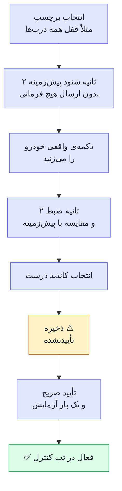
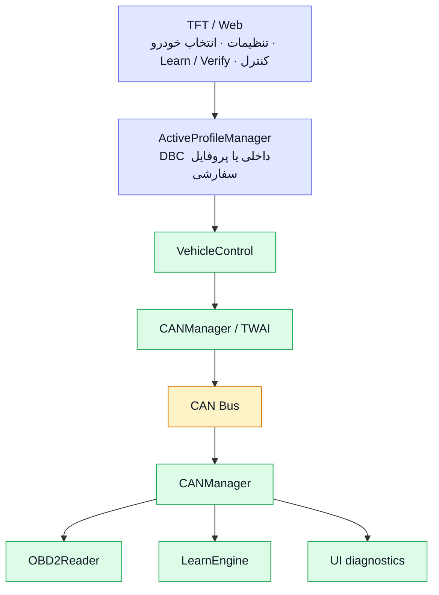

<div align="center" dir="rtl">

<h1 align="center" dir="rtl" id="-cartouch">🚗 CarTouch</h1>

<h3 align="center" dir="rtl">پایش و کنترل خودرو با ESP32-S3 و CAN Bus<br>لمسی · وب · یادگیرنده</h3>


</div>

<br>

<div dir="rtl">

> [!WARNING]
> ‏<b>هشدار ایمنی</b>
>
> ‏<b>CarTouch</b> مستقیماً روی <b>CAN Bus زنده‌ی خودرو</b> کار می‌کند. ارسال یک فریم اشتباه می‌تواند باعث رفتار ناخواسته‌ی خودرو شود.
>
> ‏توسعه و آزمایش را ابتدا روی میز و در شرایط کنترل‌شده انجام دهید، حالت <b>Listen-Only</b> را تا زمان اطمینان فعال نگه دارید و هر فرمان کنترلی را فقط روی خودرویی اجرا کنید که اختیار آزمایش آن را دارید.

<br>

<h2 align="center" dir="rtl" id="-فهرست">📑 فهرست</h2>

<table align="center" dir="rtl">
<thead>
<tr><th align="center">#</th><th align="center">بخش</th></tr>
</thead>
<tbody>
<tr><td align="center">۱</td><td align="center"><a href="#-معرفی">✨ معرفی</a></td></tr>
<tr><td align="center">۲</td><td align="center"><a href="#-وضعیت-و-محدودیتها">🧭 وضعیت و محدودیت‌ها</a></td></tr>
<tr><td align="center">۳</td><td align="center"><a href="#-learn-mode">🎓 یادگیری فرمان از خودرو</a></td></tr>
<tr><td align="center">۴</td><td align="center"><a href="#-قطعات-مورد-نیاز">🔩 قطعات مورد نیاز</a></td></tr>
<tr><td align="center">۵</td><td align="center"><a href="#-سیمبندی">🔌 سیم‌بندی</a></td></tr>
<tr><td align="center">۶</td><td align="center"><a href="#-نصب-و-راهاندازی">🚀 نصب و راه‌اندازی</a></td></tr>
<tr><td align="center">۷</td><td align="center"><a href="#-اولین-اجرا">🔑 اولین اجرا</a></td></tr>
<tr><td align="center">۸</td><td align="center"><a href="#-معماری-و-امنیت">🏗️ معماری و امنیت</a></td></tr>
<tr><td align="center">۹</td><td align="center"><a href="#-ساختار-پروژه">📂 ساختار پروژه</a></td></tr>
<tr><td align="center">۱۰</td><td align="center"><a href="#-مستندات-بیشتر">📚 مستندات بیشتر</a></td></tr>
</tbody>
</table>

<br>

---

<h2 align="center" dir="rtl" id="-معرفی">✨ معرفی</h2>

<p align="center" dir="rtl">
‏<b>CarTouch</b> یک سامانه‌ی embedded مبتنی بر <b>ESP32-S3</b> برای پایش و کنترل خودرو از طریق CAN Bus است.<br>
رابط اصلی دستگاه یک <b>TFT لمسی</b> است و یک <b>Web Dashboard</b> نیز از طریق Wi‑Fi در دسترس است.<br>
فرمان‌های کنترلی فقط پس از <b>تأیید صریح شما</b> اجرا می‌شوند.
</p>

<table align="center" dir="rtl">
<thead>
<tr><th align="center">قابلیت</th><th align="center">توضیحات</th></tr>
</thead>
<tbody>
<tr>
<td align="center">🎮<br><b>کنترل</b></td>
<td align="center">TFT لمسی با LVGL<br>(تب‌های Control‏، Dashboard‏، Learn و Settings)<br>+ Web Dashboard با HTTP API و WebSocket</td>
</tr>
<tr>
<td align="center">📊<br><b>مانیتورینگ</b></td>
<td align="center">خواندن OBD-II با state machine <b>غیرمسدودکننده</b><br><code>loop()</code> اصلی هرگز روی پاسخ ECU مسدود نمی‌شود</td>
</tr>
<tr>
<td align="center">🔀<br><b>Dual CAN</b></td>
<td align="center">CAN1 با TWAI/TJA1051<br>CAN2 با MCP2515/TJA1050 (کریستال 8 MHz)<br>وضعیت، Listen-Only‏، diagnostics و recovery مستقل برای هر باس</td>
</tr>
<tr>
<td align="center">🔎<br><b>CAN Monitor</b></td>
<td align="center">نمایش و ضبط شنودی CAN1‏، CAN2 یا هر دو در Web UI احرازشده<br>حداکثر 100 فایل CSV با سقف 256KiB برای هر فایل در SPIFFS<br>فهرست، دانلود، حذف، شمارش frame drop و توقف امن<br>Timestamp برحسب میلی‌ثانیه از uptime است<br>replay و import ارائه نشده‌اند</td>
</tr>
<tr>
<td align="center">🎓<br><b>یادگیری</b></td>
<td align="center">ضبط baseline/action روی کانال منتخب CAN1 یا CAN2<br>تشخیص candidate‏، ذخیره و چرخه‌ی تأیید<br>همچنین ورود دستی CAN ID و بایت‌ها</td>
</tr>
<tr>
<td align="center">✅<br><b>چرخه‌ی تأیید</b></td>
<td align="center">فرمان‌های یادگرفته‌شده تا زمان تأیید صریح کاربر اجرا نمی‌شوند</td>
</tr>
<tr>
<td align="center">💾<br><b>پروفایل خودرو</b></td>
<td align="center">انتخاب پروفایل DBC داخلی یا پروفایل سفارشی (JSON روی SPIFFS)<br>با فهرست، import/export و مدیریت فرمان‌ها</td>
</tr>
<tr>
<td align="center">🛡️<br><b>ایمنی</b></td>
<td align="center">Listen-Only<br>محدودیت فاصله‌ی فرمان و duty-cycle برای actuatorهای مکانیکی<br>توکن نشست WebSocket و ابطال نشست‌ها هنگام تغییر رمز</td>
</tr>
<tr>
<td align="center">🧾<br><b>لاگ و وضعیت</b></td>
<td align="center">لاگ خطا (ring buffer + شمارنده‌های پایدار NVS)<br>وضعیت runtime ماژول‌ها روی TFT و Web</td>
</tr>
<tr>
<td align="center">🔌<br><b>USB Serial</b></td>
<td align="center">کنسول headless برای:<br><code>status</code> · <code>config</code> · <code>CAN</code> · <code>OBD</code> · <code>Learn</code> · <code>storage</code> · <code>errors</code><br>شروع، توقف و فهرست وضعیت ضبط<br>فرمان‌های کنترل فقط از مسیر guarded موجود عبور می‌کنند</td>
</tr>
<tr>
<td align="center">🔋<br><b>انرژی</b></td>
<td align="center">Auto Sleep پس از ۱۰ دقیقه بی‌فعالیتی<br>بیدار شدن بر اساس فعالیت CAN</td>
</tr>
<tr>
<td align="center">⬆️<br><b>به‌روزرسانی</b></td>
<td align="center">OTA firmware/filesystem از طریق Web احرازشده و BLE با رمز<br>BLE همچنین DTC و Recorder را با AUTH‏، session متصل به connection و همان صف فرمان مشترک ارائه می‌دهد<br>اما جایگزین کامل Web UI نیست</td>
</tr>
<tr>
<td align="center">⚙️<br><b>تنظیمات CAN</b></td>
<td align="center">تنظیم پین، bitrate و mode هر دو باس<br>انتخاب مستقل کانال OBD و Learn از Web<br>اعمال پیکربندی پس از reboot</td>
</tr>
</tbody>
</table>

<br>

---

<h2 align="center" dir="rtl" id="-وضعیت-و-محدودیتها">🧭 وضعیت و محدودیت‌ها</h2>

<p align="center" dir="rtl">قبل از شروع بدانید چه چیزی پشتیبانی می‌شود و چه محدودیت‌هایی وجود دارد:</p>

<table align="center" dir="rtl">
<thead>
<tr><th align="center">موضوع</th><th align="center">وضعیت</th></tr>
</thead>
<tbody>
<tr>
<td align="center"><b>خواندن OBD-II</b></td>
<td align="center">✅ polling PIDها در Single Frame<br>DTC Mode 03 با state machine غیرمسدودکننده و پشتیبانی Single/First/Consecutive Frame و Flow Control<br>پاک‌کردن Mode 04 فقط پس از تأیید ECU<br>کانال OBD مستقل است و TX fallback خودکار وجود ندارد<br>ISO-TP عمومی برای سرویس‌های دلخواه هنوز پشتیبانی نمی‌شود</td>
</tr>
<tr>
<td align="center"><b>ولتاژ ECU</b></td>
<td align="center">✅ فقط از OBD PID <code>0x42</code> و در بازه‌ی ۶ تا ۳۶ ولت<br>مقدار ناموجود یا منقضی‌شده <code>N/A</code> نمایش داده می‌شود<br>ورودی ADC مستقل، calibration و درصد شارژ پشتیبانی نمی‌شود</td>
</tr>
<tr>
<td align="center"><b>DTC</b></td>
<td align="center">✅ خواندن و پاک‌کردن در Dashboard وب و USB Serial‏؛ نمایش NRC و فهرست کدها<br>نتیجه‌ی فیزیکی فقط با ECU سازگار قابل تأیید است</td>
</tr>
<tr>
<td align="center"><b>Learn Mode</b></td>
<td align="center">⚠️ برای خودروهایی که فرمان‌های کنترلی آن‌ها <b>rolling code</b> یا مکانیزم مشابه دارند تضمین‌شده نیست</td>
</tr>
<tr>
<td align="center"><b>پارسر DBC</b></td>
<td align="center">✅ Intel و Motorola‏؛ سقف ایمنی <b>۴۰۰ پیام</b> در هر فایل<br><code>CM_</code> و <code>VAL_</code> تفسیر نمی‌شوند<br>هر انتخاب خودرو یک فایل DBC بارگذاری می‌کند<br>فایل‌های چندمنبعی به‌صورت خودکار merge نمی‌شوند</td>
</tr>
<tr>
<td align="center"><b>DBC با شناسه‌ی Extended</b></td>
<td align="center">✅ با پرچم <code>isExtended</code> نگهداری می‌شوند<br>فایل‌هایی که شناسه‌ی ۲۹ بیتی را بدون bit 31 ذخیره کرده‌اند نیز تشخیص داده می‌شوند</td>
</tr>
<tr>
<td align="center"><b>تنظیمات CAN1/CAN2</b></td>
<td align="center">✅ پین‌های رزروشده و تداخل GPIO بررسی می‌شود و تغییرها پس از ذخیره و reboot اعمال می‌شوند<br>MCP2515 با کریستال 8 MHz فقط bitrateهای 100‏، 125‏، 250‏، 500 و 1000 kbps را می‌پذیرد</td>
</tr>
<tr>
<td align="center"><b>اتصال فیزیکی CAN</b></td>
<td align="center">⚠️ موفقیت <code>twai_driver_install()</code> یا <code>twai_start()</code> به‌تنهایی اتصال فیزیکی ترنسیور و سیم‌کشی صحیح را ثابت نمی‌کند</td>
</tr>
<tr>
<td align="center"><b>SPIFFS</b></td>
<td align="center">اگر mount نشود، سیستم آن را <b>خودکار format نمی‌کند</b><br>فایل‌های سفارشی حفظ می‌شوند و قابلیت‌های وابسته به filesystem تا رفع مشکل غیرفعال می‌مانند</td>
</tr>
<tr>
<td align="center"><b>HTTPS</b></td>
<td align="center">❌ ندارد — ترافیک وب رمزنگاری نمی‌شود</td>
</tr>
<tr>
<td align="center"><b>Secure Boot<br>Flash Encryption</b></td>
<td align="center">❌ در تنظیمات پروژه فعال نشده‌اند</td>
</tr>
<tr>
<td align="center"><b>BLE Pairing</b></td>
<td align="center">⚠️ از نوع Just Works است (بدون حفاظت MITM)<br>لینک رمزنگاری می‌شود ولی هویت طرف مقابل در زمان pairing تأیید نمی‌شود<br>جزئیات در <a href="./BLE_OTA.md"><code>BLE_OTA.md</code></a></td>
</tr>
<tr>
<td align="center"><b>کیفیت CI</b></td>
<td align="center">✅ در آخرین گزارش: 96 تست native بدون خطا<br>بررسی مسیرهای TX و محدودیت DBC و جدول bit-timing برای MCP2515 موفق<br>cppcheck بدون هشدار HIGH/MEDIUM (فقط یک هشدار LOW سبکی در هدر کتابخانه‌ی MCP2515 برای هر پروفایل)<br>عدد دقیق همیشه از CI همان commit معتبر است</td>
</tr>
<tr>
<td align="center"><b>تست روی خودرو</b></td>
<td align="center">بیلد CI معیار اصلی صحت کامپایل است<br>اجرای واقعی روی خودرو همچنان نیازمند سخت‌افزار و آزمون کنترل‌شده است</td>
</tr>
</tbody>
</table>

<br>

---

<h2 align="center" dir="rtl" id="-learn-mode">🎓 یادگیری فرمان از خودرو</h2>

<h3 align="center" dir="rtl">Learn Mode</h3>

<p align="center" dir="rtl">
هر خودرو فرمان‌های کنترلی مخصوص خودش را دارد.<br>
Learn Mode با شنود امن (Listen-Only) فرمان را از دکمه‌ی فیزیکی خودرو یاد می‌گیرد:
</p>



<h3 dir="rtl">مراحل کار</h3>

<p dir="rtl">1️⃣ دستگاه را به CAN Bus وصل کنید (بخش <a href="#-سیمبندی">سیم‌بندی</a>).</p>

<p dir="rtl">2️⃣ از تب «Learn» (روی TFT یا وب) یک برچسب فرمان انتخاب کنید.</p>

<p dir="rtl">3️⃣ دستگاه ۲ ثانیه پیام‌های پیش‌زمینه (baseline) را می‌شنود — <b>بدون ارسال هیچ فرمانی</b>‏.</p>

<p dir="rtl">4️⃣ دکمه‌ی فیزیکی خودرو را بزنید؛ دستگاه پیام‌های جدید یا تغییرکرده را ضبط می‌کند.</p>

<p dir="rtl">5️⃣ از میان کاندیدهای یافت‌شده، گزینه‌ی درست را انتخاب کنید.</p>

<p dir="rtl">6️⃣ فرمان با وضعیت «تأییدنشده» (⚠️) ذخیره می‌شود و <b>قابل اجرا نیست</b>‏.</p>

<p dir="rtl">7️⃣ با یک تأیید جداگانه (که CAN ID و بایت‌های واقعی را نشان می‌دهد) آن را یک‌بار آزمایش و نتیجه را دستی تأیید می‌کنید.</p>

<p dir="rtl">8️⃣ فقط پس از این مرحله، فرمان در مسیر عادی کنترل فعال می‌شود.</p>

> [!NOTE]
> ‏تشخیص کاندیدها نیمه‌خودکار است و تأیید نهایی همیشه با شماست. هیچ فرمان کنترلی از Learn Mode پیش از تأیید صریح کاربر ارسال نمی‌شود.
>
> ‏معماری، الگوریتم و قوانین ایمنی: [`CarTouch_SPEC.md`](./CarTouch_SPEC.md)

<br>

---

<h2 align="center" dir="rtl" id="-قطعات-مورد-نیاز">🔩 قطعات مورد نیاز</h2>

<table align="center" dir="rtl">
<thead>
<tr><th align="center">قطعه</th><th align="center">تعداد</th><th align="center">توضیحات</th></tr>
</thead>
<tbody>
<tr>
<td align="center"><b>ESP32-S3 DevKitC-1</b><br>(ماژول N16R8)</td>
<td align="center">۱</td>
<td align="center">فلش ۱۶ مگابایت<br>+ PSRAM هشت مگابایتی</td>
</tr>
<tr>
<td align="center"><b>ماژول CAN با TJA1051</b><br>نمونه: CJMCU-1051</td>
<td align="center">۱</td>
<td align="center">برای CAN1 (TWAI)<br>VCC برابر 5V<br>اگر برد پایه‌ی <code>VIO</code> دارد، آن را به 3.3V وصل کنید</td>
</tr>
<tr>
<td align="center"><b>ماژول MCP2515 + TJA1050</b><br>(کریستال 8 MHz)</td>
<td align="center">۱</td>
<td align="center">برای CAN2<br>VCC برابر 5V<br>SPI آن با TFT/Touch مشترک است</td>
</tr>
<tr>
<td align="center"><b>نمایشگر TFT با ILI9341</b></td>
<td align="center">۱</td>
<td align="center">SPI‏، همراه Touch Controller از نوع XPT2046</td>
</tr>
<tr>
<td align="center"><b>مبدل تغذیه</b></td>
<td align="center">۱</td>
<td align="center">ورودی تغذیه‌ی خودرو با مبدل مناسب به 3.3V</td>
</tr>
<tr>
<td align="center"><b>سیم jumper و محفظه</b></td>
<td align="center">—</td>
<td align="center">برای اتصال و نصب داخل خودرو</td>
</tr>
</tbody>
</table>

<br>

> [!IMPORTANT]
> ‏پروژه برای پنل <b>ILI9341</b> تنظیم شده است (<code>-DILI9341_DRIVER=1</code> در <code>platformio.ini</code>).
>
> ‏اگر پنل شما کنترلر دیگری دارد، درایور را در <code>platformio.ini</code> عوض کنید و ابعاد رابط کاربری را با آن تطبیق دهید.

<br>

---

<h2 align="center" dir="rtl" id="-سیمبندی">🔌 سیم‌بندی</h2>

<h3 align="center" dir="rtl">پین‌های ESP32-S3 برای TFT‏، تاچ و CAN</h3>

<table align="center" dir="rtl">
<thead>
<tr><th align="center">سیگنال</th><th align="center">GPIO</th></tr>
</thead>
<tbody>
<tr><td align="center">CAN1 / TWAI TX</td><td align="center"><b>17</b></td></tr>
<tr><td align="center">CAN1 / TWAI RX</td><td align="center"><b>18</b></td></tr>
<tr><td align="center">TFT CS</td><td align="center"><b>10</b></td></tr>
<tr><td align="center">TFT DC</td><td align="center"><b>7</b></td></tr>
<tr><td align="center">TFT RST</td><td align="center"><b>4</b></td></tr>
<tr><td align="center">SPI MOSI</td><td align="center"><b>11</b></td></tr>
<tr><td align="center">SPI MISO</td><td align="center"><b>13</b></td></tr>
<tr><td align="center">SPI SCLK</td><td align="center"><b>12</b></td></tr>
<tr><td align="center">TFT Backlight</td><td align="center"><b>21</b></td></tr>
<tr><td align="center">Touch CS</td><td align="center"><b>14</b></td></tr>
<tr><td align="center">CAN2 / MCP2515 CS</td><td align="center"><b>15</b></td></tr>
<tr><td align="center">CAN2 / MCP2515 INT</td><td align="center"><b>16</b></td></tr>
</tbody>
</table>

<br>

> [!TIP]
> ‏پین‌های نهایی را همیشه از <code>src/config.h</code> و <code>platformio.ini</code> بررسی کنید.

<h3 dir="rtl">CAN2 (MCP2515)</h3>

<ul dir="rtl">
<li>CAN2 از کریستال 8 MHz روی MCP2515 و ترنسیور TJA1050 استفاده می‌کند.</li>
<li>SPI با TFT/Touch مشترک است. SPI HAL در Arduino-ESP32 transactionهای هم‌زمان روی bus را با mutex داخلی سری می‌کند.</li>
<li>هر کد task جدید باید انتقال SPI را با <code>beginTransaction()</code> / <code>endTransaction()</code> انجام دهد.</li>
<li>CS و INT قابل تنظیم هستند و پیش‌فرض آن‌ها GPIO15 و GPIO16 است.</li>
<li>زمین ماژول‌ها باید مشترک باشد.</li>
</ul>

> [!CAUTION]
> ‏GPIOهای ESP32-S3 <b>مقاوم در برابر 5V نیستند.</b>
>
> ‏سطح منطقی TJA1051 به variant برد بستگی دارد و خروجی RXD نباید بیش از 3.3V به ESP32-S3 بدهد. بسیاری از بردهای MCP2515/TJA1050 با منطق 5V کار می‌کنند؛ در نبود level shifter روی خود برد، برای SCK/MOSI/CS و نیز MISO/INT مبدل سطح مناسب قرار دهید.
>
> ‏<b>هیچ سیگنال 5V را مستقیم به GPIO متصل نکنید.</b>

<br>

---

<h2 align="center" dir="rtl" id="-نصب-و-راهاندازی">🚀 نصب و راه‌اندازی</h2>

<h3 dir="rtl">پیش‌نیازها</h3>

<ul dir="rtl">
<li>Git</li>
<li><a href="https://code.visualstudio.com/">VS Code</a></li>
<li>افزونه‌ی PlatformIO</li>
</ul>

<h3 dir="rtl">دستورهای بیلد و آپلود</h3>

<table align="center" dir="rtl">
<thead>
<tr><th align="center">کاربرد</th><th align="center">دستور</th></tr>
</thead>
<tbody>
<tr><td align="center">N16R8‏، فلش 16MB و PSRAM نوع OPI</td><td align="center"><code>pio run -e esp32-s3-devkitc-1</code></td></tr>
<tr><td align="center">N16R8 بدون init نمایشگر/تاچ</td><td align="center"><code>pio run -e esp32-s3-headless</code></td></tr>
<tr><td align="center">فلش 4MB بدون PSRAM</td><td align="center"><code>pio run -e esp32-s3-4mb</code></td></tr>
<tr><td align="center">فلش 4MB با PSRAM نوع QSPI</td><td align="center"><code>pio run -e esp32-s3-4mb-psram</code></td></tr>
<tr><td align="center">filesystem کامل 16MB</td><td align="center"><code>pio run -e esp32-s3-devkitc-1 -t buildfs</code></td></tr>
<tr><td align="center">filesystem کوچک 4MB</td><td align="center"><code>pio run -e esp32-s3-4mb -t buildfs</code></td></tr>
<tr><td align="center">همان filesystem برای PSRAM نوع QSPI</td><td align="center"><code>pio run -e esp32-s3-4mb-psram -t buildfs</code></td></tr>
<tr><td align="center">آپلود firmware</td><td align="center"><code>pio run -e esp32-s3-devkitc-1 -t upload</code></td></tr>
<tr><td align="center">آپلود filesystem (وب و DBC)</td><td align="center"><code>pio run -e esp32-s3-devkitc-1 -t uploadfs</code></td></tr>
<tr><td align="center">مانیتور سریال</td><td align="center"><code>pio device monitor</code></td></tr>
</tbody>
</table>

<br>

> [!WARNING]
> ‏<b>هشدار:</b> فرمان دستی <code>uploadfs</code> کل SPIFFS را جایگزین می‌کند و می‌تواند پروفایل‌های یادگرفته‌شده، ضبط‌های CAN و DBCهای کاربر را پاک کند.
>
> ‏قبل از اجرا داده‌ها را export کرده و در محل دیگری پشتیبان بگیرید.
>
> ‏OTA وب تا وقتی پروفایل، ضبط CAN یا مانیفست/فایل بازیابی DBC کاربر در SPIFFS داخلی وجود دارد، جایگزینی را رد می‌کند؛ خود OTA پشتیبان خودکار نمی‌سازد.

> [!WARNING]
> ‏<b>محدودیت پیکربندی حافظه</b>
>
> ‏پروفایل اصلی <code>esp32-s3-devkitc-1</code> از برد N16R8 با فلش 16MB و PSRAM نوع OPI استفاده می‌کند. پروفایل‌های <code>esp32-s3-4mb</code> و <code>esp32-s3-4mb-psram</code> جدول واقعی 4MB و filesystem کوچک‌شده دارند؛ دومی برای PSRAM نوع QSPI است.
>
> ‏firmware فعلی در هر دو پروفایل نزدیک به سقف 1.5MB هر OTA slot است، بنابراین تغییرات بزرگ بعدی ممکن است به جدول پارتیشن تازه نیاز داشته باشد.

<h3 dir="rtl">پروفایل 4MB</h3>

<ul dir="rtl">
<li>فقط Web UI و 10 فایل DBC منطقه‌ای/وارداتی منتخب بسته‌بندی می‌شوند.</li>
<li>مجموعه‌ی کامل 57 فایل در <code>data/dbc</code> دست‌نخورده می‌ماند و برای پروفایل 16MB است.</li>
<li>فهرست خودرو در زمان اجرا فقط DBCهای موجود در filesystem را نشان می‌دهد.</li>
<li>DBCهای کاربر و ضبط CAN از سیاست انتخاب SPIFFS/SD استفاده می‌کنند؛ پروفایل‌های سفارشی فعلاً فقط در SPIFFS ذخیره می‌شوند.</li>
<li>SD پیش‌فرض غیرفعال است، خودکار format نمی‌شود و mount/removal آن روی سخت‌افزار هنوز نیازمند آزمون است.</li>
<li>صفحه‌ی وب ترجیح مستقل DBC‏، پروفایل، ضبط و پشتیبان را ذخیره می‌کند، اما در حال حاضر فقط ترجیح DBC و ضبط به مسیر ذخیره‌سازی وصل است؛ ذخیره‌ی پروفایل روی SD و backup/restore واقعی موجود نیست.</li>
<li>درایور اختیاری Five-way از GPIO یا ADC‏، تنظیم Serial و رویدادهای کوتاه/بلند را دارد و ورودی keypad را به LVGL می‌دهد؛ تنظیم از Web/BLE و آزمون عملی روی برد هنوز انجام نشده‌اند.</li>
<li>تنظیم پین نمایشگر در زمان اجرا و کنترلرهای TFT غیر از ILI9341 نیز پشتیبانی نمی‌شوند.</li>
</ul>

<h3 dir="rtl">پروفایل Headless</h3>

<ul dir="rtl">
<li>پروفایل <code>esp32-s3-headless</code> نمایشگر، تاچ و بافرهای LVGL را init/رزرو نمی‌کند.</li>
<li>دسترسی شبکه و BLE مستقل می‌ماند و از جدول 16MB استفاده می‌کند.</li>
<li>همه‌ی پروفایل‌های نمایش‌دار فعلی روی پین‌بندی ثابت ILI9341/XPT2046 در <code>platformio.ini</code> تنظیم شده‌اند.</li>
</ul>

<br>

<details>
<summary><b>🔍 بررسی کیفیت (static analysis و تست‌های native)</b></summary>

<br>

```bash
pio check -e esp32-s3-devkitc-1 --skip-packages
pio test -e native
pio run -e esp32-s3-4mb
pio run -e esp32-s3-4mb-psram
pio run -e esp32-s3-headless
```

</details>

<details>
<summary><b>🧰 فلش دستی با esptool</b></summary>

<br>

<ul dir="rtl">
<li>پروفایل اصلی از جدول <code>cartouch_16MB.csv</code> استفاده می‌کند.</li>
<li>پروفایل‌های 4MB از <code>cartouch_4MB.csv</code> و filesystem کوچک‌شده از Web UI و DBCهای منتخب استفاده می‌کنند؛ فایل‌های اصلی در <code>data/</code> حذف یا تغییر نمی‌کنند.</li>
<li>فضای SPIFFS چهارمگابایتی برای کل مجموعه‌ی DBC کافی نیست.</li>
<li>برای نقشه‌ی کامل پارتیشن‌ها و imageهای هر دو اندازه، <code>CarTouch_SPEC.md</code> بخش 19 («نقشه‌ی آدرس‌های فلش») را ببینید.</li>
</ul>

<p align="center" dir="rtl"><b>آدرس فایل‌ها برای جدول 16MB</b></p>

<table align="center" dir="rtl">
<thead>
<tr><th align="center">فایل</th><th align="center">آدرس</th></tr>
</thead>
<tbody>
<tr><td align="center"><code>bootloader.bin</code></td><td align="center"><code>0x0</code></td></tr>
<tr><td align="center"><code>partitions.bin</code></td><td align="center"><code>0x8000</code></td></tr>
<tr><td align="center"><code>boot_app0.bin</code></td><td align="center"><code>0xE000</code></td></tr>
<tr><td align="center"><code>firmware.bin</code></td><td align="center"><code>0x10000</code></td></tr>
<tr><td align="center"><code>spiffs.bin</code></td><td align="center"><code>0xA10000</code></td></tr>
</tbody>
</table>

<br>

<p dir="rtl"><b>تنظیمات ابزارهای فلش گرافیکی (مثل ESP32 Flash/Erase)</b></p>

<ul dir="rtl">
<li>چیپ ESP32-S3‏، فلش 16MB (یا 4MB برای پروفایل‌های 4MB)، فرکانس 80MHz و حالت QIO (در صورت بوت‌نشدن، DIO).</li>
<li><code>boot_app0.bin</code> را حتماً جداگانه روی <code>0xE000</code> اضافه کنید.</li>
<li>فایل‌ها باید همه از یک پوشه‌ی بیلد (یک پروفایل) باشند.</li>
</ul>

<p dir="rtl"><b>جدول 4MB</b></p>

<ul dir="rtl">
<li>آدرس <code>spiffs.bin</code> برابر <code>0x310000</code> است؛ سایر imageهای سیستم در همان آدرس‌های جدول بالا قرار دارند.</li>
<li>جدول و اندازه‌ی دقیق همه‌ی پارتیشن‌ها در بخش 19 مشخصات فنی آمده است.</li>
<li><code>boot_app0.bin</code> در <code>0xE000</code> داخل پارتیشن <code>otadata</code> نوشته می‌شود و پارتیشن جدا نیست.</li>
</ul>

</details>

<details>
<summary><b>📦 کتابخانه‌ها (خودکار توسط PlatformIO نصب می‌شوند)</b></summary>

<br>

<table align="center" dir="rtl">
<thead>
<tr><th align="center">کتابخانه</th><th align="center">نسخه</th><th align="center">کاربرد</th></tr>
</thead>
<tbody>
<tr><td align="center">TFT_eSPI</td><td align="center">2.5.43</td><td align="center">درایور نمایشگر و تاچ</td></tr>
<tr><td align="center">lvgl</td><td align="center">8.4.0</td><td align="center">رابط گرافیکی</td></tr>
<tr><td align="center">ESPAsyncWebServer</td><td align="center">3.12.1</td><td align="center">وب‌سرور Async + OTA</td></tr>
<tr><td align="center">AsyncTCP</td><td align="center">3.5.0</td><td align="center">TCP Async</td></tr>
<tr><td align="center">ArduinoJson</td><td align="center">7.4.3</td><td align="center">کار با JSON</td></tr>
<tr><td align="center">NimBLE-Arduino</td><td align="center">2.5.1</td><td align="center">BLE و BLE OTA</td></tr>
<tr><td align="center">autowp-mcp2515</td><td align="center">1.3.1</td><td align="center">درایور MCP2515 برای CAN2</td></tr>
</tbody>
</table>

</details>

<br>

> [!NOTE]
> ‏CI firmwareهای اصلی، headless و 4MB را می‌سازد و imageهای filesystem کامل و کوچک را بررسی می‌کند.
>
> ‏محتوای کامل <code>data/</code> فقط در پروفایل 16MB قرار می‌گیرد؛ فایل‌های learned‏، ضبط‌های CAN و DBCهای کاربر ممکن است در زمان اجرا در SPIFFS باشند، بنابراین پیش از <code>uploadfs</code> دستی حتماً آن‌ها را export و در محل دیگری backup بگیرید.

<h3 dir="rtl">بیلد خودکار (CI)</h3>

<ul dir="rtl">
<li>workflow در <code>.github/workflows/main.yml</code> چهار پروفایل را می‌سازد.</li>
<li>filesystem‏، static analysis‏، تست‌های native‏، بررسی اندازه‌ی SPIFFS و بررسی‌های DBC/MCP2515/مسیرهای TX را اجرا می‌کند.</li>
<li>خروجی نهایی <b>یک artifact</b> با نام <code>cartouch-firmware</code> است که برای هر پروفایل یک پوشه (به‌همراه <code>boot_app0.bin</code> و فایل‌های <code>.sha256</code>) دارد.</li>
<li>پروفایل <code>headless</code> عمداً filesystem نمی‌سازد.</li>
<li>گزارش کامل در artifact جداگانه‌ی <code>ci-report</code> است.</li>
</ul>

<br>

---

<h2 align="center" dir="rtl" id="-اولین-اجرا">🔑 اولین اجرا</h2>

<p dir="rtl">1️⃣ دستگاه را روشن کنید و در صورت نیاز، کالیبراسیون لمسی را انجام دهید.</p>

<p dir="rtl">2️⃣ به Access Point دستگاه وصل شوید یا تنظیمات Station را انجام دهید.</p>

<p dir="rtl">3️⃣ آدرس وبی که در Serial Monitor نمایش داده می‌شود را در مرورگر باز کنید.</p>

<p dir="rtl">4️⃣ با حساب مدیریتی وارد شوید.</p>

<p dir="rtl">5️⃣ <b>نام کاربری و رمز پیش‌فرض ثابت است:</b></p>

<table align="center" dir="rtl">
<thead>
<tr><th align="center">نام کاربری</th><th align="center">رمز</th></tr>
</thead>
<tbody>
<tr><td align="center"><code>CarTouch</code></td><td align="center"><code>12345678</code></td></tr>
</tbody>
</table>

<br>

> [!WARNING]
> ‏این مقدار فقط در <code>src/config.h</code> تعریف شده است (<code>WEB_DEFAULT_USER</code> و <code>WEB_DEFAULT_PASS</code>). در مخزن عمومی دیده می‌شود و فقط برای استفاده‌ی شخصی/توسعه پذیرفته شده است؛ <b>پیش از اشتراک‌گذاری یا فروش دستگاه آن را عوض کنید.</b>
>
> ‏وای‌فای، وب، صفحه و بلوتوث همه از همین یک رمز استفاده می‌کنند و رمز وای‌فای بعد از تغییر رمز و راه‌اندازی مجدد عوض می‌شود.
>
> ‏با <code>CT_REQUIRE_PASSWORD_CHANGE=1</code> فقط BLE و OTA بلوتوثی تا تغییر رمز رد می‌شوند و ورود وب مسدود نمی‌شود؛ مقدار فعلی 0 است.

<p dir="rtl">6️⃣ برای آزمایش CAN ابتدا Listen-Only را نگه دارید.</p>

<p dir="rtl">7️⃣ پیش از فعال‌کردن فرمان‌های کنترلی، پروفایل خودرو را انتخاب یا ایجاد کنید و هر فرمان یادگرفته‌شده را جداگانه تأیید کنید.</p>

<br>

---

<h2 align="center" dir="rtl" id="-معماری-و-امنیت">🏗️ معماری و امنیت</h2>

<h3 dir="rtl">🧩 جریان نرم‌افزار</h3>



<p dir="rtl">جزئیات معماری، قراردادهای بین ماژول‌ها و محدودیت‌های ایمنی در <a href="./CarTouch_SPEC.md"><code>CarTouch_SPEC.md</code></a> نگهداری می‌شود.</p>

<br>

<h3 dir="rtl">🛡️ امنیت</h3>

<ul dir="rtl">
<li>Listen-Only باید نقطه‌ی شروع آزمایش CAN باشد.</li>
<li>فرمان‌های Learn Mode ابتدا به‌صورت تأییدنشده ذخیره می‌شوند و ارسال فرمان آزمایشی فقط از مسیر تأیید صریح انجام می‌شود.</li>
<li>WebSocket بدون session token معتبر پذیرفته نمی‌شود.</li>
<li>تغییر رمز، نشست‌های قبلی را بی‌اعتبار می‌کند.</li>
<li>بدنه‌ی درخواست‌های HTTP پیش از parse سقف دارد؛ واردکردن پروفایل و بارگذاری DBC سقف‌های جداگانه دارند و بدنه‌های با طول نامشخص رد می‌شوند. OTA فایل به‌صورت تکه‌ای نوشته می‌شود و اندازه‌اش را محدودیت پارتیشن کنترل می‌کند.</li>
<li>OTA فقط از مسیر احراز هویت‌شده در دسترس است.</li>
<li>درخواست‌های تغییردهنده‌ی (POST/PUT/PATCH/DELETE) که مرورگر از یک وب‌سایت دیگر بفرستد با خطای 403 رد می‌شوند (بررسی هدر Origin در برابر Host)؛ ابزارهای بدون هدر Origin مثل curl همچنان با رمز کار می‌کنند.</li>
<li>نام (label) فرمان فقط حرف انگلیسی، عدد، فاصله و <code>_ - .</code> می‌پذیرد و خروجی‌های وب هنگام نمایش escape می‌شوند.</li>
<li>Host Guard روی همه‌ی درخواست‌ها و WebSocket upgrade اعمال می‌شود؛ ورود ناموفق مکرر از یک IP موقتاً قفل می‌شود و پاسخ‌های وب هدرهای سخت‌سازی (<code>nosniff</code>‏، <code>X-Frame-Options</code>‏، <code>no-store</code>) دارند.</li>
<li>فرمان سفارشی بدون metadata معتبر actuator قابل اجرا نیست (fail-closed) و تأیید یک پروفایل مشخص، خودروی فعال را تغییر نمی‌دهد.</li>
<li>OTA از Web و BLE مالک انحصاری دارد و هم‌زمان اجرا نمی‌شود؛ SHA-256 فقط صحت داده را بررسی می‌کند و امضای دیجیتال نیست.</li>
<li>USB Serial احراز هویت جدا ندارد (دسترسی فیزیکی)، اما فرمان‌های کنترلی همچنان از همان gate مشترک عبور می‌کنند.</li>
</ul>

> [!CAUTION]
> ‏<b>ریسک‌های پذیرفته‌شده‌ی فعلی</b>
>
> ‏نبود HTTPS (session و رمز روی شبکه‌ی محلی محرمانگی TLS ندارند؛ Base64 رمزنگاری نیست)، ذخیره‌ی رمز در NVS به‌صورت متن ساده، و غیرفعال‌بودن Secure Boot و Flash Encryption‏.
>
> ‏جزئیات و مرزهای اعتماد: بخش «مدل امنیتی» در [`CarTouch_SPEC.md`](./CarTouch_SPEC.md).

<br>

<h3 dir="rtl">📁 DBC</h3>

<ul dir="rtl">
<li>فایل‌های DBC در <code>data/dbc/</code> داده‌ی ورودی سیستم هستند و metadata داخلی خودشان را حفظ می‌کنند.</li>
<li><code>VehicleDB</code> فقط فایل‌هایی را که برای انتخاب مستقیم مناسب تشخیص داده شده‌اند به فهرست خودروها متصل می‌کند؛ فایل‌های دیگر ممکن است برای merge چندمنبعی، ADAS/radar یا ساختارهای خاص نگهداری شده باشند.</li>
<li>صفحه‌ی Settings ترجیح مستقل محل DBC‏، پروفایل سفارشی، ضبط CAN و پشتیبان را نگه می‌دارد و Reset آن‌ها را به Automatic برمی‌گرداند.</li>
<li>در وضعیت فعلی فقط ذخیره‌ی DBC و ضبط CAN از سیاست SPIFFS/SD استفاده می‌کنند.</li>
<li>پروفایل سفارشی در SPIFFS می‌ماند و backup/restore واقعی هنوز پیاده‌سازی نشده است.</li>
</ul>

<br>

<h3 dir="rtl">📡 وضعیت Runtime و ماژول‌ها</h3>

<ul dir="rtl">
<li>وضعیت runtime ماژول‌های Wi-Fi‏، Web Server‏، CAN Bus‏، OBD-II‏، Touch‏، Display‏، BLE و Storage روی TFT و Web UI نمایش داده می‌شود.</li>
<li>وضعیت‌ها شامل <code>DETECTED</code>‏، <code>INITIALIZING</code>‏، <code>READY</code>‏، <code>NOT DETECTED</code>‏، <code>ERROR</code> و <code>DISABLED</code> هستند.</li>
<li>CAN diagnostics شامل شمارنده‌های RX/TX‏، خطا و وضعیت bus است.</li>
<li>قطع یک ماژول نباید boot کل دستگاه را متوقف کند.</li>
</ul>

<br>

<h3 dir="rtl">📏 اندازه‌گیری Heap و Stack</h3>

<ul dir="rtl">
<li>از USB Serial با سرعت 115200‏، فرمان <code>memory</code> را اجرا کنید تا heap آزاد فعلی/کمینه‌ی زمان boot‏، بزرگ‌ترین بلوک قابل تخصیص، وضعیت PSRAM و high-water کمینه‌ی stack وظیفه‌ی اصلی <code>loop</code> نمایش داده شود.</li>
<li>برای سنجش، دستگاه را reboot کنید تا مقدارهای کمینه از boot تازه شروع شوند.</li>
<li>سپس workloadهای سنگین و هم‌زمان (وب، ثبت CAN روی هر دو باس، انتخاب/بارگذاری DBC و BLE) را اجرا و خروجی را در طول آزمون ثبت کنید.</li>
<li>این فرمان stack taskهای مستقل AsyncTCP/BLE را اندازه نمی‌گیرد و خروجی اجرای سخت‌افزاری باید جداگانه ثبت شود؛ مقدارهای build یا شبیه‌سازی جایگزین اندازه‌گیری روی برد نیستند.</li>
</ul>

<br>

<h3 dir="rtl">⬆️ OTA و BLE</h3>

<ul dir="rtl">
<li>OTA برای firmware و filesystem از Web UI فعال است و برای هر تصویر، SHA-256 مورد انتظار را از artifact همان build می‌گیرد؛ فایل‌های <code>.sha256</code> همراه firmware در خروجی CI هستند.</li>
<li>BLE مستقل از Wi-Fi اجرا می‌شود و BLE OTA فقط پس از تطبیق اندازه و SHA-256 فعال می‌شود؛ قالب قدیمی <code>START</code> بدون هش پذیرفته نمی‌شود.</li>
<li>Firmware روی slot غیرفعال نوشته می‌شود، اما rollback سلامت پس از اولین boot پیاده نشده؛ filesystem یک پارتیشن دارد و بازیابی خودکار در قطع برق ندارد.</li>
<li>SHA-256 امضای دیجیتال نیست و ارتباط وب HTTPS ندارد.</li>
<li>نسخه‌ی firmware از <code>CAR_TOUCH_FIRMWARE_VERSION</code> در <code>src/config.h</code> می‌آید.</li>
<li>Web و BLE نمی‌توانند هم‌زمان مالک یک OTA باشند.</li>
<li>جزئیات در <a href="./BLE_OTA.md"><code>BLE_OTA.md</code></a> و بخش «OTA و filesystem» مشخصات فنی.</li>
</ul>

<br>

---

<h2 align="center" dir="rtl" id="-ساختار-پروژه">📂 ساختار پروژه</h2>

<div dir="ltr">

```
CarTouch/
├── platformio.ini                # تنظیمات PlatformIO، پین‌ها و کتابخانه‌ها
├── cartouch_16MB.csv             # جدول پارتیشن ۱۶ مگابایتی
├── cartouch_4MB.csv              # جدول پارتیشن ۴ مگابایتی
├── boards/                       # تعریف بردهای N16R8 و 4MB
├── scripts/                      # چک‌های CI و اسکریپت filesystem 4MB
├── README.md                     # همین فایل
├── CarTouch_SPEC.md              # مشخصات فنی، معماری، حافظه، OTA، فلش و مدل امنیتی
├── BLE_OTA.md                    # پروتکل BLE و BLE OTA
├── DBC_AUDIT.md                  # گزارش خودکار DBC (خروجی scripts/audit_dbc.py)
├── THIRD_PARTY_NOTICES.md        # مجوزها و منشأ وابستگی‌ها/داده‌ها
├── LICENSE
├── .github/workflows/            # بیلد خودکار در GitHub Actions
├── src/
│   ├── main.cpp                  # setup + loop
│   ├── config.cpp/.h             # پین‌ها، ثابت‌ها، تنظیمات
│   ├── can_manager.cpp/.h        # مدیریت CAN1 (TWAI)
│   ├── can_service.cpp/.h        # مسیریابی بین CAN1 و CAN2
│   ├── mcp2515_can_interface.*   # درایور CAN2 (MCP2515)
│   ├── can_interface.h           # رابط مشترک باس‌ها
│   ├── can_recorder.*            # ضبط CAN (CSV)
│   ├── obd2_reader.cpp/.h        # خواندن OBD-II (غیرمسدودکننده)
│   ├── vehicle_control.cpp/.h    # اجرای فرمان‌ها
│   ├── vehicle_db.cpp/.h         # پارسر DBC (Intel + Motorola)
│   ├── dbc_store.*               # ذخیره و مدیریت DBCهای کاربر
│   ├── tft_ui.cpp/.h             # رابط لمسی LVGL
│   ├── buttons.*                 # ورودی Five-way (اختیاری)
│   ├── webserver.cpp/.h          # وب‌سرور + WebSocket + OTA
│   ├── wifi_manager.cpp/.h       # Wi-Fi (AP/STA)
│   ├── ble_manager.cpp/.h        # BLE و BLE OTA
│   ├── sd_storage.*              # ذخیره‌سازی SD (پیش‌فرض غیرفعال)
│   ├── module_status.cpp/.h      # وضعیت runtime ماژول‌ها
│   ├── custom_vehicle.h          # ساختار پروفایل‌های سفارشی
│   ├── custom_vehicle_store.*    # ذخیره JSON در SPIFFS
│   ├── learn_engine.*            # موتور یادگیری (capture/diff)
│   ├── active_profile_manager.*  # یکپارچه‌ساز DBC + سفارشی
│   ├── error_log.*               # لاگ خطا و شمارنده‌های پایدار
│   └── ct_*.h / ct_*.cpp         # منطق مستقل از سخت‌افزار (guard، parser، validation، OTA lock، SHA-256)
├── test/test_native/             # تست‌های native (Unity)
└── data/                         # محتوای SPIFFS
    ├── index.html, style.css, app.js   # Web Dashboard
    ├── dbc/                            # فایل‌های DBC (57 فایل + manifest)
    └── custom_vehicles/                # در زمان اجرا ساخته می‌شود (نه در سورس)
```

</div>

<br>

---

<h2 align="center" dir="rtl" id="-مستندات-بیشتر">📚 مستندات بیشتر</h2>

<table align="center" dir="rtl">
<thead>
<tr><th align="center">فایل</th><th align="center">چه چیزی در آن هست</th></tr>
</thead>
<tbody>
<tr>
<td align="center"><a href="./CarTouch_SPEC.md"><code>CarTouch_SPEC.md</code></a></td>
<td align="center">معماری ماژول‌ها، Learn Mode و verification‏، Listen-Only‏، DBC<br>حافظه (فرمان <code>memory</code>)، OTA و filesystem‏، نقشه‌ی فلش<br>مدل امنیتی و قراردادهای ایمنی و تست</td>
</tr>
<tr>
<td align="center"><a href="./BLE_OTA.md"><code>BLE_OTA.md</code></a></td>
<td align="center">پروتکل BLE و BLE OTA و نکات امنیتی آن</td>
</tr>
<tr>
<td align="center"><a href="./DBC_AUDIT.md"><code>DBC_AUDIT.md</code></a></td>
<td align="center">گزارش خودکار فایل‌های DBC<br>(تولید با <code>scripts/audit_dbc.py</code>‏؛ دستی ویرایش نکنید)</td>
</tr>
<tr>
<td align="center"><a href="./THIRD_PARTY_NOTICES.md"><code>THIRD_PARTY_NOTICES.md</code></a></td>
<td align="center">نسخه، منبع و مجوز وابستگی‌ها<br>وضعیت منشأ/مجوز DBCها</td>
</tr>
</tbody>
</table>

<br>

---

<p align="center" dir="rtl"><b>📜 مجوز:</b> اختصاصی (همه‌ی حقوق محفوظ) — متن کامل در <code>LICENSE</code></p>

<p align="center" dir="rtl"><a href="#-cartouch">⬆️ بازگشت به بالا</a></p>

</div>
